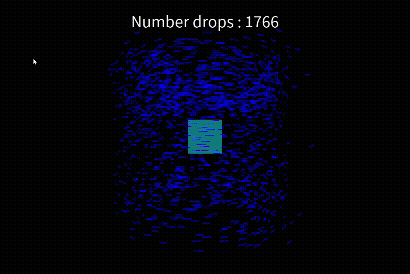
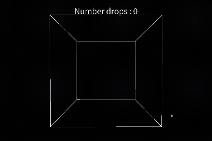
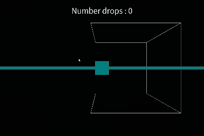
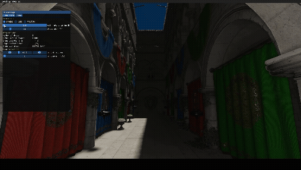
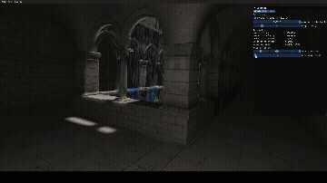

# SIMU_Rain

Ce dépôt contient un **proof of concept** réalisé durant un stage de recherche, dont l’objectif était de proposer une simulation réaliste de la pluie et de ses interactions avec l’environnement.

L’idée consiste à simuler un nombre fini de particules dans un espace restreint, en n’utilisant qu’un ensemble réduit de paramètres simples et intuitifs. Les particules sont simulées à l’intérieur d’une boîte de délimitation pouvant prendre, au choix : la forme d’un *frustum*, un cube englobant ce frustum ou une sphère centrée sur la caméra. Les gouttes quittant cette zone, ou entrant en collision avec un obstacle, peuvent être **recyclées** puis réinjectées dans la simulation. La simulation est gouvernée par un unique paramètre simple et intuitif : **l’intensité de la pluie en mm/h**. Ce paramètre influence le mouvement de chaque goutte, le nombre de particules visibles et leur taille. Voici quelques résultats obtenus :

|  |  |  |
| - | - | - |
|  |  |  | 

|  |  |  |
| - | - | - |
|  |  |  | 

Des vidéos de meilleure qualité sont disponibles dans le dossier */results/*, ainsi qu’un PDF détaillant plus en profondeur l’approche.
